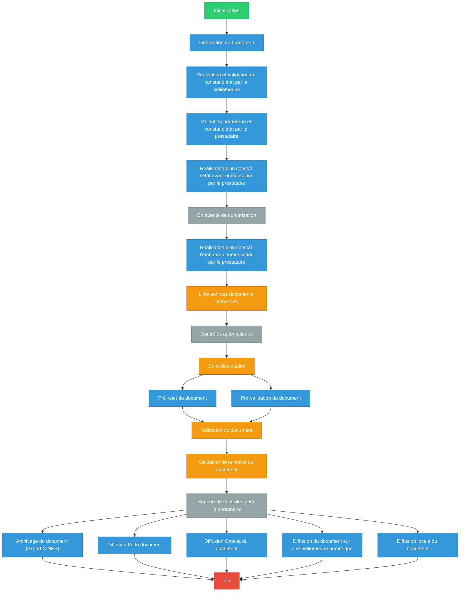

import Icon from '@site/src/components/Icon';

## <Icon icon={["fa", "chart-diagram"]} /> Configuration des workflows

### Le déroulé d'un projet dans NumaHOP

Un <Icon icon={["fa", "book"]} />**projet** correspond à un ensemble de lots réunis dans une cohérence.

*Exemples de projet* : une reprise de données, des projets ponctuels de numérisation en interne, ou une année de numérisation courante (par
exemple « Numérisation 2022 »).

Il peut contenir un ou plusieurs <Icon icon={["fa", "boxes-stacked"]} />**lots**. Un lot est un ensemble de documents eux aussi regroupés dans une cohérence.

*Exemple de lot* : 36 manuscrits anciens ; un fonds d’archives ; 45 périodiques reliés ; 300 photos.

Un lot peut être découpé en <Icon icon={["fa", "box"]} />**trains**. Cela permet notamment de livrer les documents par paquets sur NumaHOP.

*Exemple de train* : au lieu de livrer les 27 000 pages des 45 périodiques d’un coup, le lot sera divisé en 3 trains : PER 1 à PER 15, PER 16 à PER 30 et PER 31 à PER 45.

Cela permet d’effectuer les tâches au fur et à mesure, et de planifier le travail en le découpant.

Enfin, le lot contient des <Icon icon={["fa", "file"]} />**unités documentaires ou UD**. Une UD, c’est l’association d’informations identitaires (libellé, cote, rattachement au projet et au lot), d’une notice, de fichiers images, et éventuellement d’un constat d’état.

NumaHOP fonctionne avec des <Icon icon={["fa", "chart-diagram"]} />**workflows**, dans lesquels chaque étape de la chaîne de traitement est reliée à un groupe d’utilisateurs.

### Qu'est-ce qu'un <Icon icon={["fa", "chart-diagram"]} />workflow ?

Une chaîne d’actions qui se répartissent du début à la fin d’un <Icon icon={["fa", "book"]} />**projet**.
Le workflow comporte toutes les étapes d’un projet de numérisation à partir de son initialisation jusqu’à sa clôture, en passant par les constats d’état, la livraison des fichiers, le contrôle qualité, la validation des documents et des notices, puis l’archivage et la diffusion des documents.
Chaque étape est reliée à un groupe <Icon icon={["fa", "user"]} /> **d'utilisateurs**.

Le workflow reflète la manière de travailler de l’établissement. Il est possible de créer plusieurs workflows, pour s’adapter aux spécificités d’un projet ou à la typologie de documents.

:::caution Le **workflow** s’applique au **lot**, et donc à tous les **trains** et **UD** du lot.
Un lot ne peut donc pas :
- contenir des UD qu’il faut archiver au CINES et d’autres non
- contenir des UD pour lesquelles il faut faire un constat d’état et d’autres non
Toutes les UD du lot seront traitées dans la même chaîne, seront contrôlées de la même façon, et seront diffusées au même endroit.
:::

#### L'administration des workflows

Dans le menu <Icon icon={["fa", "gear"]} />**Administration**, l'encart **Worflow** propose deux volets :

##### Les groupes utilisateurs

Chaque étape du workflow devant être reliée à un groupe <Icon icon={["fa", "user"]} /> **d'utilisateurs**, il convient de créer ces groupes et d’y associer les utilisateurs concernés.

Il peut y avoir autant de groupes que d’étapes dans le workflow, si chaque étape incombe à des personnes différentes. C’est le plus  
simple, mais ce n’est pas une obligation.

- Cliquer sur **Gestion des groupes** affiche la liste des groupes de workflow existants (on peut <Icon icon={["fa", "magnifying-glass"]} />rechercher dans la liste grâce à la barre de recherche)
- Cliquer sur un groupe dans la liste alphabétique pour afficher ses détails et le modifier (en cliquant sur <Icon icon={["fa", "pen-to-square"]} /> en haut à droite)
- Cliquer sur le bouton <Icon icon={["fa", "square-plus"]} /> pour en créer un

Dans l’encart qui s’affiche, la partie supérieure présente les informations générales du groupe : donner un nom au groupe (obligatoire), une description (facultatif) et le rattacher à une bibliothèque (obligatoire).

En-dessous apparaît l’encart des noms des utilisateurs : cliquer dans la barre « Commencez à taper… » pour faire apparaître la liste déroulante des utilisateurs enregistrés. Sélectionner les personnes devant figurer dans le groupe. Le nom s’implémente dans l’encart.
Ajouter successivement tous les utilisateurs à intégrer au groupe, puis cliquer sur <Icon icon={["fa", "floppy-disk"]} />**Enregistrer**.

:::caution Seuls les utilisateurs ayant un compte NumaHOP apparaîtront dans la liste.
Si un usager n’y figure pas, il faudra d’abord lui créer un compte utilisateur.
:::

Une fois le groupe créé, il apparaît dans la liste des groupes de workflow trouvés, classés par ordre alphabétique.

##### Les modèles de workflow

Cette entrée se présente de la même manière que les autres : la liste à gauche (si des modèles ont déjà été créés) et les détails à droite quand on clique sur un modèle.
La liste est rangée par ordre alphabétique, cliquer sur un modèle de workflow dans la liste affiche ses détails et permet d’entrer en mode édition pour le modifier.

Il est possible de créer plusieurs workflows, selon les projets, ou encore la typologie de documents.
Par exemple, une reprise de données d’un passif ayant déjà été archivé au CINES n’aura pas besoin d’intégrer l’archivage dans son workflow. Cette étape sera donc rendue « non requise ».
Certains projets peuvent requérir un contrôle qualité en deux étapes (pré-rejet et pré-validation, puis validation finale).
D’autre part, le workflow par défaut comporte toutes les étapes prévues par NumaHOP, dont la diffusion Omeka ou Internet Archive ; des étapes peut-être non pertinentes pour certains établissements.

##### Créer un workflow

Appuyer sur le bouton <Icon icon={["fa", "square-plus"]} /> à côté de la barre de recherche.

Remplir les données d’usage : Nom (obligatoire), Description (facultatif), Bibliothèque (obligatoire). Choisir de rendre actif ou non le workflow en cochant la case correspondante.

Toutes les étapes du workflow apparaissent dans la partie inférieure sous forme de logigramme.

:::tip En vert : l’étape d’initialisation
:::

:::info En bleu : les étapes non requises
:::

:::caution En orange : les étapes requises. 
La croix dans ces cases indique qu’il manque des informations à renseigner
:::

En gris : les étapes automatiques réalisées par NumaHOP.

:::danger En rouge : l’étape finale
:::

Pour paramétrer le workflow, on peut intervenir sur les cases bleues et orange.

##### Renseigner les étapes obligatoires

Il s’agit des 4 étapes en orange dans le modèle qui s’affiche par défaut, comportant une croix <Icon icon={["fa", "xmark"]} /> .
Elles sont obligatoires et forcément requises : 
- Livraison des documents numérisé
- Contrôle qualité
- Validation du document
- Validation de la notice du document
   
Cliquer sur une étape, par exemple, « Livraison des documents numérisés ». Une fenêtre s’ouvre : indiquer le groupe responsable et cliquer sur OK.
On voit que l’étape est validée par la coche <Icon icon={["fa", "check"]} />

Procéder de même pour les autres étapes.

##### Personnaliser son workflow

Le reste des étapes est en bleu, donc des étapes non requises par défaut. Mais si elles sont requises dans le circuit tel que décidé par
l’établissement, il est possible de les rendre obligatoires.
Pour cela, cliquer sur l’étape concernée. Par exemple, la réalisation et la validation du constat d’état par la bibliothèque.
Dans la fenêtre qui s’ouvre, choisir le groupe responsable dans la liste déroulante, et sélectionner « étape requise » dans la liste déroulante associée au type d’étape.

Procéder ainsi pour toutes les étapes concernées.

Une fois le workflow paramétré, cliquer sur <Icon icon={["fa", "floppy-disk"]} />**Enregistrer**.

#### Le workflow dans un projet et un lot

Le workflow s’applique au <Icon icon={["fa", "boxes-stacked"]} />**lots**. C’est dans la création de celui-ci que le workflow sera choisi (voir [créer un lot]docs/utilisateur/3-gestion-lots.md)

Cela signifie que toutes les Unités Documentaires de ce lot auront le même workflow.

#### Démarrer le workflow

Avant de commencer un lot, ne pas oublier de démarrer le workflow.

Pour cela, dans le menu « Projets », cliquer sur Projets :

La liste des projets en cours s’affiche. Cliquer sur le projet concerné
par le lot pour lequel il faut démarrer le workflow :

Les détails du projet s’affichent à droite :

Cliquer sur le bouton « détails » en haut à droite.

C’est par défaut la liste de toutes les unités documentaires du lot qui
s’affiche.

Cliquer sur l’onglet Lots dans la barre de menu pour afficher les lots :

La liste des lots du projet apparaît.

Repérer le lot pour lequel démarrer le workflow et cliquer sur le bouton
« démarrer le workflow à droite » :

La fenêtre suivante s’ouvre, cliquer sur « Confirmer » :  

